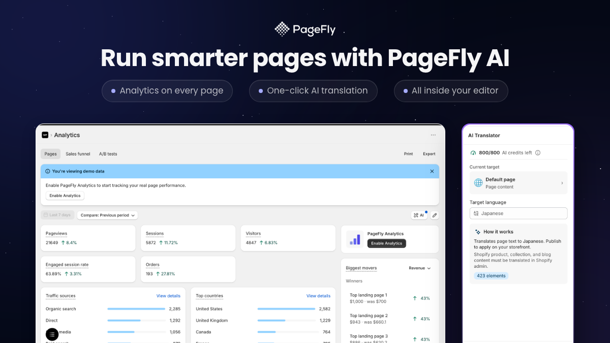

# feature-demo

A Claude / agent **skill** that turns a real UI screenshot into a polished,
brand-framed feature-demo image: App Store hero, social tile, "What's New"
modal, blog header. It places your screenshot inside a designed frame with a
heading, bullet pills, background glow, and an optional logo.

**The screenshot is pass-through pixels** - it is embedded unchanged. The agent
may *look* at the image to decide layout, but never feeds it through a model to
redraw or regenerate it. What you ship is your real UI.

Renders two ways:

- **PNG** via Playwright (headless Chromium) - a file you get instantly.
- **Figma** via the Figma MCP - editable nodes you can fine-tune.

English · [Tiếng Việt](./README-vi.md)

---

## What it looks like




Four templates (`hero-stack`, `hero-split`, `feature-callout`, `product-card`)
× theme (dark / light) × size (16:9 hero, 1:1 social, 16:9 modal). A
desktop + mobile screenshot pair auto-becomes a "device duo". Run it and look in
`outputs/`.

> The examples above use the `pagefly` brand preset. The default `neutral`
> preset renders without a logo and with a brand-agnostic palette.

## Requirements

- Node.js >= 18
- One Playwright Chromium download (for PNG mode)
- A Figma MCP connection (only for Figma mode - optional)

## Install

This skill ships as part of [pd-agent-skills](../../README.md). From the repo root:

```bash
git clone https://github.com/notdaran/pd-agent-skills.git
cd pd-agent-skills
./install.sh
```

That symlinks every skill into `~/.claude/skills/` and installs the
`/feature-demo` command. Then install this skill's renderer dependencies:

```bash
cd skills/feature-demo
npm install
npx playwright install chromium
```

Then in Claude Code: `/feature-demo <feature-spec-path> <screenshot-path>`.

### Standalone (no agent, just the renderer)

```bash
git clone https://github.com/notdaran/pd-agent-skills.git
cd pd-agent-skills/skills/feature-demo
npm install
npx playwright install chromium
```

## Usage (direct CLI)

```bash
npx tsx scripts/run-render.tsx png \
  --template=hero-stack --variation=top \
  --screenshots=path/to/desktop.png,path/to/mobile.png \
  --theme=dark \
  --heading="Your headline" \
  --bullets="First point,Second point,Third point" \
  --size=1600x900
```

- `mode` (first arg): `png` | `figma` | `paper`
- `--template`: `hero-stack` | `hero-split` | `feature-callout` | `product-card`
- `--variation`: `top` / `bottom` / `left` / `right` / `upper` / `lower` (per template)
- `--screenshots`: comma-separated paths (max 3)
- `--theme`: `dark` | `light`
- `--size`: `WIDTHxHEIGHT` or a preset (`app-store` 1600x900, `modal` 1200x675, `social` 1080x1080)
- `--pair`: `overlap` (default) | `beside` - only for a desktop+mobile duo

Output lands in `outputs/` (gitignored).

## Brand presets

Branding lives in **presets**. The default is `neutral` (a brand-agnostic slate
+ blue palette, no logo) so it works for anyone out of the box. Switch presets
with the `FEATURE_DEMO_BRAND` env var:

```bash
FEATURE_DEMO_BRAND=pagefly npx tsx scripts/run-render.tsx png ...
```

### Use your own brand

1. Copy `presets/neutral.ts` to `presets/<yourbrand>.ts` and edit the colors,
   fonts, radii, and `glowPalette`.
2. To add a logo: drop `logo-light.png` + `logo-dark.png` into `assets/logos/`
   and set `logo: { light: 'logo-light.png', dark: 'logo-dark.png' }` in your
   preset. Leave `logo: null` for no logo.
3. Register your preset in `brand.ts` (add it to the `presets` map).
4. Run with `FEATURE_DEMO_BRAND=<yourbrand>`.

> Fonts: the repo ships Poppins (SIL OFL, free to redistribute). To use a
> different font, replace the `.woff2` files in `assets/fonts/` and update the
> `@font-face` / `fonts.check` references in `renderers/shared/html-shell.ts`
> and `renderers/playwright-renderer.tsx`.

## How it fits together

```
brand.ts          -> picks a preset by FEATURE_DEMO_BRAND (default: neutral)
presets/          -> brand token sets (neutral, pagefly, your own)
types.ts          -> Zod schemas (AssetSpec, BrandTokens, ...)
templates/        -> 4 layout recipes (PNG component + Figma intent builder)
renderers/        -> playwright (PNG), figma (MCP plan), paper (stub)
scripts/          -> run-render.tsx (CLI), agent-entry.tsx (agent helpers)
prompts/          -> sub-prompts the agent uses (pick template, write copy, ...)
assets/           -> fonts, logos, decor, a placeholder screenshot
commands/         -> the /feature-demo slash command for Claude Code
SKILL.md          -> skill manifest the agent reads
```

## License

MIT (see [LICENSE](./LICENSE)). Poppins is under the SIL Open Font License 1.1.
The PageFly logo in `assets/logos/` belongs to its owner and is only the
optional `pagefly` preset - remove it if you are not authorized to use it.
