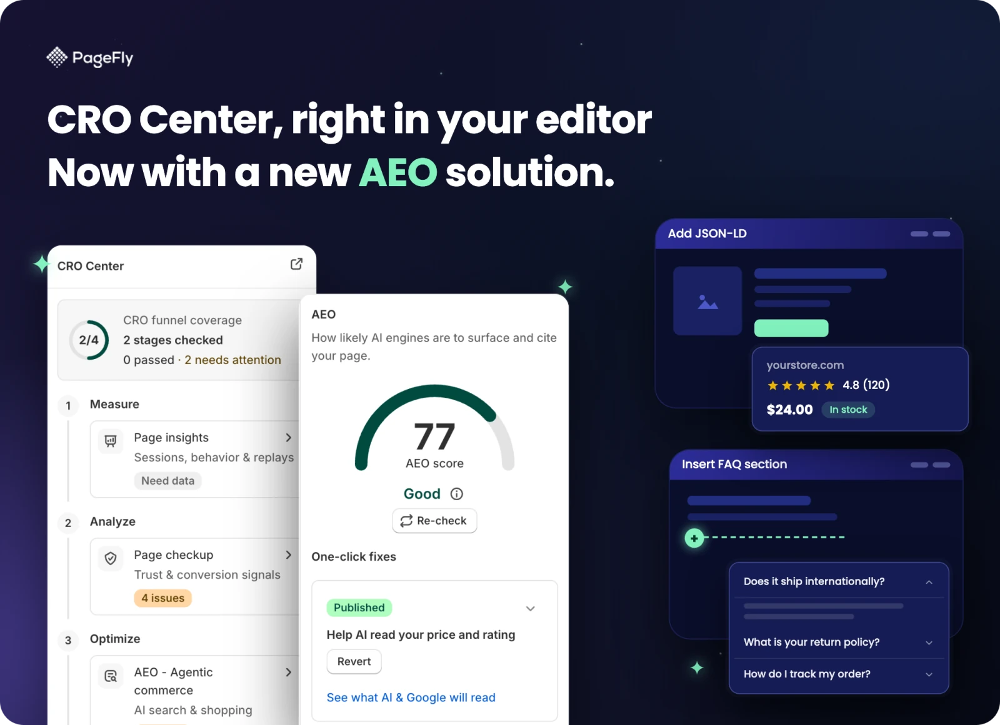
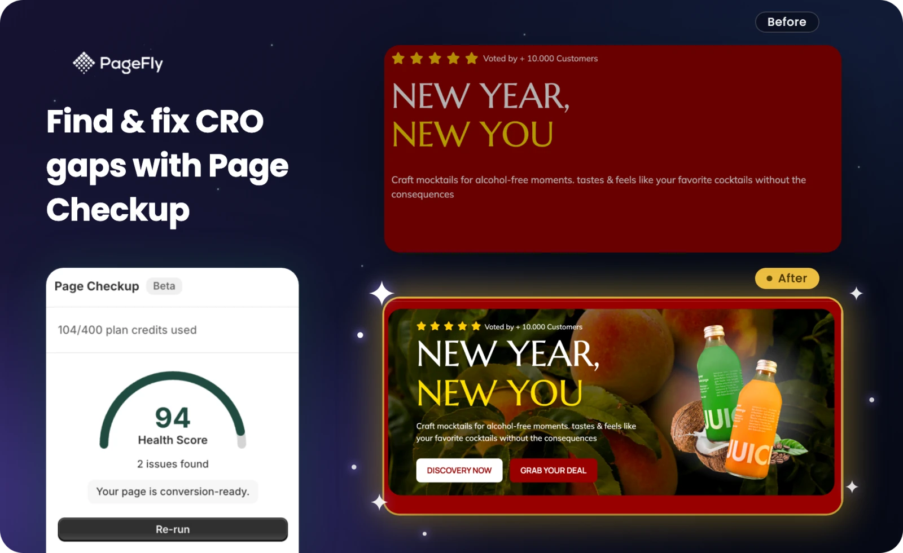

# illustra

Một **skill** cho Claude / agent, chuyên vẽ phần minh hoạ *bên trong* một thẻ
marketing: ô bento, thẻ feature trên App Store, khối feature trên website.

Nó trộn hai loại chất liệu trên cùng một khung:

- **Ảnh chụp sản phẩm thật**, được đóng khung và chú thích. Ảnh **đi thẳng qua
  không qua model nào** - chỉ cắt, không vẽ lại, không tái tạo. Thứ bạn ship là
  giao diện thật của bạn.
- **UI vector vẽ tay**, viết bằng HTML / CSS / SVG thuần: panel editor, vòng
  điểm, đường kéo thả, thẻ A/B, khung chọn, biểu đồ.

Kết quả là một file PNG nền trong suốt độ phân giải retina, thả thẳng lên thẻ
đích.

[English](./README.md) · Tiếng Việt

---

## Trông như thế nào



Mọi panel nền trắng ở trên là **ảnh chụp thật**, cắt trên khe trắng và nhúng
nguyên không sửa. Hai cửa sổ tối "Add JSON-LD" và "Insert FAQ section" bên cạnh
là **vector vẽ tay** - chúng mô tả một luồng chưa có ảnh chụp. Chính cái trộn đó
là điểm cốt lõi của skill.



Vẫn quy tắc đó áp cho một cặp trước/sau: hai ảnh chụp storefront thật và một
panel điểm thật, phần glow, tia sáng và badge trạng thái thì vẽ vector quanh
chúng.

## Khác gì so với việc chỉ viết prompt

Ba thứ nằm sẵn trong skill và được áp mỗi lần chạy:

- **Bộ component** (`components/`) - 22 mảnh vector dùng lại được, mỗi mảnh là
  một đoạn HTML độc lập. Mảnh vẽ riêng nào xuất hiện lần thứ hai thì được đưa
  vào bộ chung.
- **Style guide** (`references/style-guide.md`) - các cổng hỏi đầu vào và 16
  quy tắc bố cục đánh số (R1-R16), trong đó có bước tự soát cạnh: mỗi cặp cạnh
  kề nhau phải hoặc cách hẳn ra hoặc chồng hẳn lên, không được để khe hở mỏng
  gần song song.
- **Bộ eval** (`evals/`) - các lần chạy có chấm điểm, để khi sửa quy tắc thì so
  được với mốc cũ thay vì nhìn bằng mắt.

Phần hỏi đầu vào cố tình để dạng trò chuyện chứ không phải điền form: hỏi ảnh sẽ
nằm ở đâu, chụp một thẻ hàng xóm làm tham chiếu, rồi từ đó chọn chế độ nền sáng
hay nền kính tối. Thẻ hàng xóm chỉ dùng để thống nhất ngôn ngữ hình ảnh, không
bao giờ dùng để chép lại bố cục.

## Không dùng cho

Bố cục cả trang nhiều thẻ. Chuỗi hoạt hình - việc đó dùng [`anima`](../anima).
Ảnh tả thực hoặc ảnh sinh bằng AI: illustra chỉ có vector cộng ảnh chụp thật
đóng khung, không có gì khác.

## Yêu cầu

- Node.js >= 18

```bash
cd skills/illustra
npm install
npx playwright install chromium-headless-shell
```

> Cần cả hai bước. `npm install` kéo về `playwright-core` mà
> `scripts/render.mjs` import thẳng - cài toàn cục không ăn, vì Node không tra
> thư mục global cho bare import. Lệnh thứ hai tải bản trình duyệt, npm không
> tải hộ.

## Cài đặt

Nằm trong bộ [pd-agent-skills](../../README-vi.md):

```bash
git clone https://github.com/notdaran/pd-agent-skills.git
cd pd-agent-skills
./install.sh
```

## Render

```bash
node scripts/render.mjs <canvas.html> outputs/<ten>.png --width 1200 --height 900
```

Bắt đầu từ `templates/canvas.html` - một khung nền trong suốt đã nối sẵn brand
preset.

## Brand

Màu, font và cách làm badge lấy từ `references/brand.css`. Đổi đúng file đó là
render sang brand khác; phần logic vẽ không biết gì về brand. PageFly là preset
mặc định đi kèm.

Xem [`_pf-brand`](../_pf-brand) cho lớp nhận diện dùng chung.
